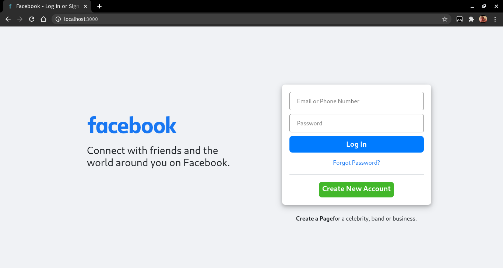

This is a [Next.js](https://nextjs.org/) project bootstrapped with [`create-next-app`](https://github.com/vercel/next.js/tree/canary/packages/create-next-app) uses [nextAuth](https://next-auth.js.org/) for Credentials authentication
## ScreenShots
login page:


main page:


error page:


loading page:


session page:

## Getting Started

First, run 

```bash
npm install # to install all dependencies including nextAuth
```


then, rename 

```bash
.env.local.example
# to
.env.local
```

then, run the development server:

```bash
npm run dev
# or
yarn dev
```

Open [http://localhost:3000](http://localhost:3000) with your browser to see the result.

You can start editing the page by modifying `pages/index.js`. The page auto-updates as you edit the file.

Authentication can be modified on `/pages/api/auth/[...nextauth].js` file to add more providers beside credintial , GITHUB provider TWITTER provider .... or customise your own setting by adding [options](https://next-auth.js.org/configuration/options)

The `pages/api` directory is mapped to `/api/*`. Files in this directory are treated as [API routes](https://nextjs.org/docs/api-routes/introduction) instead of React pages.

## Learn More next.js

To learn more about Next.js, take a look at the following resources:

- [Next.js Documentation](https://nextjs.org/docs) - learn about Next.js features and API.
- [Learn Next.js](https://nextjs.org/learn) - an interactive Next.js tutorial.

You can check out [the Next.js GitHub repository](https://github.com/vercel/next.js/) - your feedback and contributions are welcome!

## Learn More next-auth

To learn more about next-auth.js, take a look at the following resources:

- [Next-Auth Documentation](https://next-auth.js.org/getting-started/introduction) - learn about next-auth.js features
- [Learn Next-Auth.js](https://next-auth.js.org/tutorials) - Next-Auth.js tutorial.

You can check out [the Next-Auth.js GitHub repository](https://github.com/nextauthjs/next-auth) - your feedback and contributions are welcome!


## Deploy on Vercel

The easiest way to deploy your Next.js app is to use the [Vercel Platform](https://vercel.com/new?utm_medium=default-template&filter=next.js&utm_source=create-next-app&utm_campaign=create-next-app-readme) from the creators of Next.js.

Check out our [Next.js deployment documentation](https://nextjs.org/docs/deployment) for more details.
